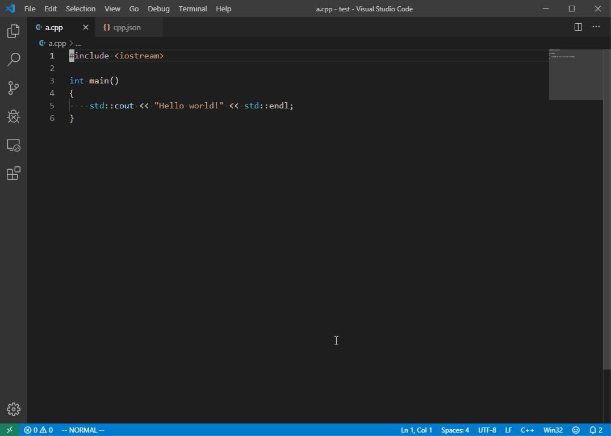

# Snippet Generator

[](https://dev.azure.com/fiore57/snippet-generator/_build/latest?definitionId=2&branchName=master)

[日本語](#概要)

## Overview
Snippet Generator is an extension of Visual Studio Code that makes it easy to add snippets.



## Description
VSCode has a function to call registered snippets. This is very useful, but to register a snippet, we must enclose the statement with double quotes on each line, or escape tabs and newlines. (of course, double quotes in the snippet must be escaped) It is quite bother to do that.
```json
{
    "hello-world": {
        "prefix": "helloworld",
        "body": [
            "#include <iostream>",
            "",
            "using namespace std;",
            "",
            "int main() {",
            "   cout << \"Hello world!\" << endl;"
            "}"
        ],
        "description": "it is sample snippet"
    }
}
```
Snippet generator allowes you to **easily** and **quickly** register snippet.

## Usage
1. Select statement.
2. Press Ctrl+Alt+S (⌘⌥S) or select "Generate snippet" in the right-click menu.
3. Select language.
4. Enter snippet name.
5. Enter snippet trigger.
6. Enter snippet description (optional).

## Settings
- "generateSnippet.snippetFilePath"

Specify the path of "snippets" file. Basically, you can use "default".

**NOTE**: If you use WSL(Windows subsystem for Linux), you have to set the path.

```json
{
    "generateSnippet.snippetFilePath": "default"
}
{
    "generateSnippet.snippetFilePath": "C:\\Users\\***\\Appdata\\Roaming\\Code\\User\\snippets\\"
}
{
    "generateSnippet.snippetFilePath": "/mnt/c/Users/***/Appdata/Roaming/Code/User/snippets"
}
```

## Key settings
- "extension.generateSnippet"
```json
{
    "key": "ctrl+alt+s",
    "command": "extension.generateSnippet"
}
```

## License
This extension is released under the WTFPL, see LICENSE.

<br />

---

<br />

## 概要
Snippet Generatorは、簡単にスニペットを追加するためのVisual Studio Code拡張機能です。

## 説明
VSCodeには、登録したスニペットを簡単に呼び出すことができる機能がついています。しかし、スニペットを登録するには、スニペット化したい文を毎行ダブルクォートで囲むか、タブや改行をエスケープしなければなりません（もちろん、スニペット内のダブルクォートはエスケープする必要があります）。これは、かなり面倒です。
```json
{
    "hello-world": {
        "prefix": "helloworld",
        "body": [
            "#include <iostream>",
            "",
            "using namespace std;",
            "",
            "int main() {",
            "   cout << \"Hello world!\" << endl;"
            "}"
        ],
        "description": "it is sample snippet"
    }
}
```

Snippet Generator は、この面倒なスニペットの登録作業を簡単に、素早く行うことができます。

## 使い方

1. スニペット化したい文字列を選択する（ファイル全体をスニペット化したい場合、選択しなくてもOK）
2. Ctrl+Alt+S（Control+Option+S）を押す。または、右クリックメニューから「スニペットを作成」を選択する
3. 言語を選択する
4. スニペットの名前を入力する
5. スニペットのトリガー（prefix）を入力する
6. スニペットの説明を入力する（任意）

## 設定
- "generateSnippet.snippetFilePath"

「snippets」ファイルのパスを指定します。基本的に、「default」で問題ありません。

（**注意**：WSL（Windows subsystem for Linux）を使用している場合、デフォルトの設定ではスニペットの作成に失敗します。）

```json
{
    "generateSnippet.snippetFilePath": "default"
}
{
    "generateSnippet.snippetFilePath": "C:\\Users\\***\\Appdata\\Roaming\\Code\\User\\snippets\\"
}
{
    "generateSnippet.snippetFilePath": "/mnt/c/Users/***/Appdata/Roaming/Code/User/snippets"
}
```

## キーバインド
- "extension.generateSnippet"
```json
{
    "key": "ctrl+alt+s",
    "command": "extension.generateSnippet"
}
```

## ライセンス
この拡張機能は、WTFPLのもとで公開されています。詳しくはLICENSEを見てください。
